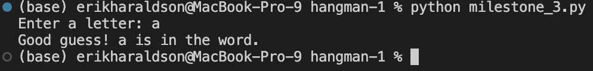
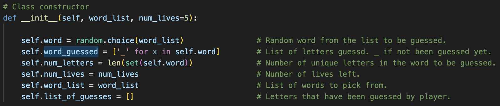
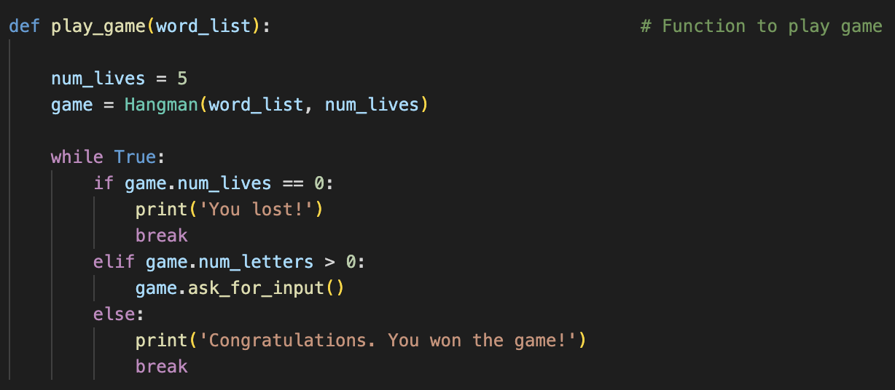
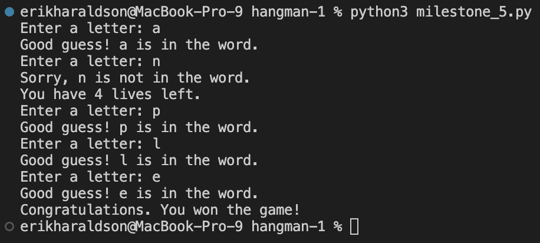
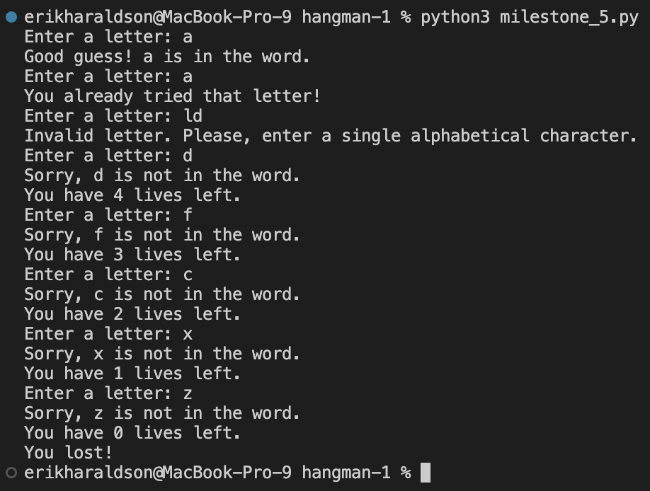

# Hangman
> For this project I am recreating the game of hangman. Some technologies used are git, python, GitHub, imports (random), lists, if and else, user input.

## Milestone 1
- Git is a VCS (Version Control System) which can utilised distributed version control along with GitHub to track changes to files, collaborate with others, display code publicly for others to read/use, and revert to old version of a codebase. These technologies are used widely in industry as they allow for safe collaboration on software projects with multiple people.

## Milestone 2
- A repository was created for this project in order to track changes and familiarise myself with working with Git and GitHub. Some basics of python are used to create different variables such as the word list and to use if/else statments. Packages were imported (random) to be used in the script and inputs are taken from the user. The terminal in vs code was used for running the file as well as staging, comitting and pushing changes to the GitHub repository from the local repository on my machine. Below is the code I wrote for this milestone:

```
# Task 1
# %%
word_list = ['Watermelon', 'Apple', 'Mango', 'Banana', 'Raspberry']

print(word_list)

# Task 2
# %%
import random

word = random.choice(word_list)

print(word)

# Task 3
# %%
guess = input("Enter a letter: ")

# Task 4
# %%
if len(guess) == 1 and guess.isalpha():
    print("Good guess!")
else:
    "Oops! That is not a valid input."
```

## Milestone 3
- For this milestone, functions for checking if the guess is in the word and asking for input (i.e. starting the game) were created with the check_guess being called in the ask_for_input. A method was also used `string.lower()`. A method is different to a function in the sense that a method is a class specific function; these always include the self argument when they are defined. For example lower() is a method of the string class to convert a string into all lower case. A while loop is also used to ensure that the user input is correct with `break` being used when the user input is in the correct format. Below is the code for this milestone:

```
# Task 1 & 2 & 3
# %%
import random

word_list = ['Watermelon', 'Apple', 'Mango', 'Banana', 'Raspberry']

word = random.choice(word_list)

def check_guess(guess):
    '''
    DOCSTRING: Checks if the guessed letter is in the word
    INPUT: guess (str)
    OUTPUT: N/A
    '''

    guess = guess.lower()

    if guess in word:
        print("Good guess! " + guess + " is in the word.")
    else:
        print("Sorry, " + guess + " is not in the word. Try again.")

def ask_for_input():
    '''
    DOCSTRING: Asks for input letter from user and checks if it is in the word
    INPUT: N/A
    OUTPUT: N/A
    '''

    while True:

        guess = input("Enter a letter: ")

        if len(guess) == 1 and guess.isalpha():
            break
        else:
            print("Invalid letter. Please, enter a single alphabetical character.")

    check_guess(guess)

ask_for_input()
```
- Below is a screenshot of the script in action.



## Milestone 4
- Created a class for Hangman with the constructor shown below using the magic method __init__:



- Also created the methods check_guess and ask_for_input that use code from the previous milestone but also adds more functionality such as having word_guessed which is a list of _ for each unguessed letter and updates when a letter is guessed right.

## Milestone 5
- The finished product is found in the milestone_5.py. The instance of the Hangman class (game in the code) acts as a snapshot of the game you are playing; keeping track of the word for that game, the guesses the player has made, the number of lives left etc. I defined a function play_game which loops to let the player play the game until they have won or lost by repeatedly calling the games ask_for_input method (basically a round of the game). The code for this function can be seen below:



- An example usage of the game where the player wins can be seen below:



- When the player loses it looks like this:

